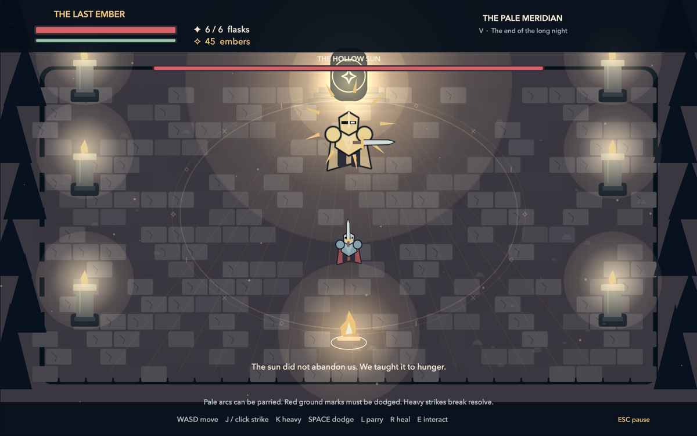

# The Last Ember

A compact native macOS soulslike built with Swift, AppKit, and SpriteKit. Fight through five haunted courts, recover lost embers after death, strengthen your blade and vitality, and break each guardian's second phase to bring back the dawn.



## Play

Requires macOS 13 or later and the Xcode command-line tools.

```sh
./build.sh
open "The Last Ember.app"
```

Move with **WASD**. Use **J** or left click to strike, **K** or right click for a heavy attack, **Space** to dodge, **L** to parry, **R** to heal, and **E** to interact. Press **Esc** to pause and **F** for fullscreen.

Run the gameplay checks with `./build.sh --test`.
